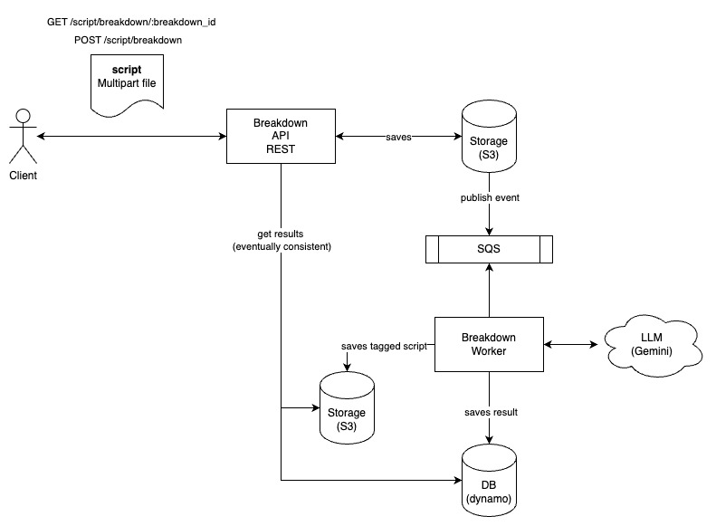

# Script Breakdown App

This applications was created to breakdown a script, adding tags for every scene element that should be considered for the production of the film.

Initially is running over Final Draft scripts, using the .fdx files as input and output. It receives an untagged script and generates a tagged version of the same .fdx.

## Dependencies

This aplication uses a LLM API in order to identify the scene elements. Initially is using Google´s Gemini, but replacing it by another provider should be as easy as changing the dependency injection on the main.go. Credits to [LangChainGo](https://github.com/tmc/langchaingo).

The input should be a script on fdx format, since it is the standard file format to export to production scheduling applications such as Movie Magic or Studio Binder.

In order to run locally, Docker Compose is needed and a Google Gemini API Key that should be set as env var.

## Architecture

